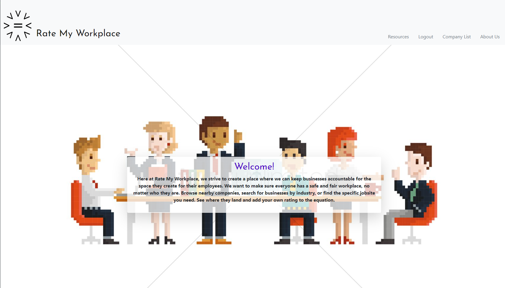

# Rate My Workplace

## Authors
### Jeremy Joanet 
Project manager | [GitHub](https://github.com/Vygoth) | [email](JeremyJoanet@protonmail.com)

### Alfredo Tlahuel
Backend developer/presenation coordinator | [GitHub](https://github.com/Vfredo602) | [email](Vfredo602@gmail.com)

### Melanie Uhrich 
Frontend designer & backend developer | [GitHub](https://github.com/melanieuhrich) | [email](melanieuhrich13@gmail.com)

### Justin Lindsey
Frontend designer & backend developer | [GitHub](https://github.com/JusticeGTR) | [email](justinlindseylhr@gmail.com)

## Description
This application has several pages that allow the user to access a variety of services. Upon creating an account, the user can find a company and its ratings, leave a review for the company, and view resources available to them. In a country with a high amount of workplace injuries and incidents, our site aims to help keep employers accountable and responsible.

## Table of Contents
- [Usage](#Usage)
- [Installation](#Dependencies)
- [Contributing](#Contributing)
- [Screenshot](#Screenshot)

## Usage
Our site is fully deployed on Heroku at https://rate-my-workplace.herokuapp.com/login. To login and view the functionality, please use the following login:

Username: user09@email.com

Password: password123

## Dependencies
npm install

## Contributing
If a user wishes to help this project, we would like to add API functionality to populate the companies database with a user's search, and by extension add a search feature to find companies based on user's parameters.

## Screenshot

